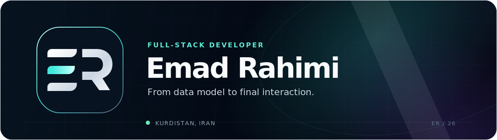
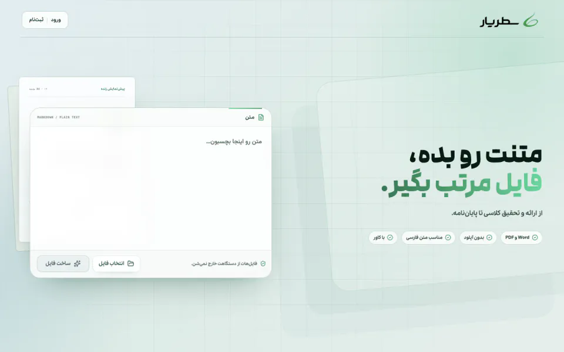
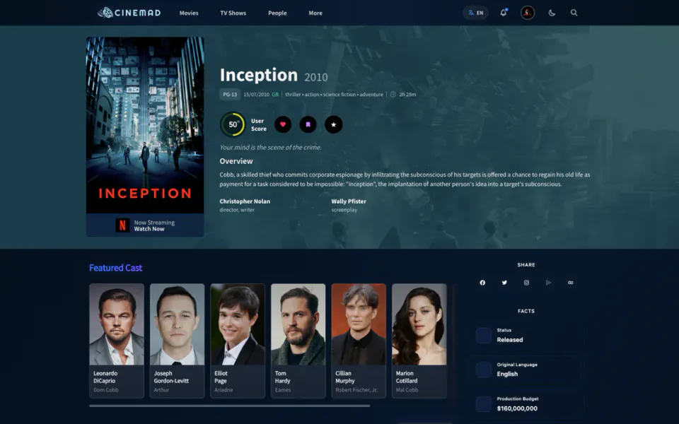
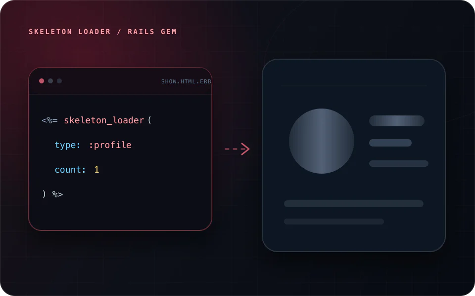
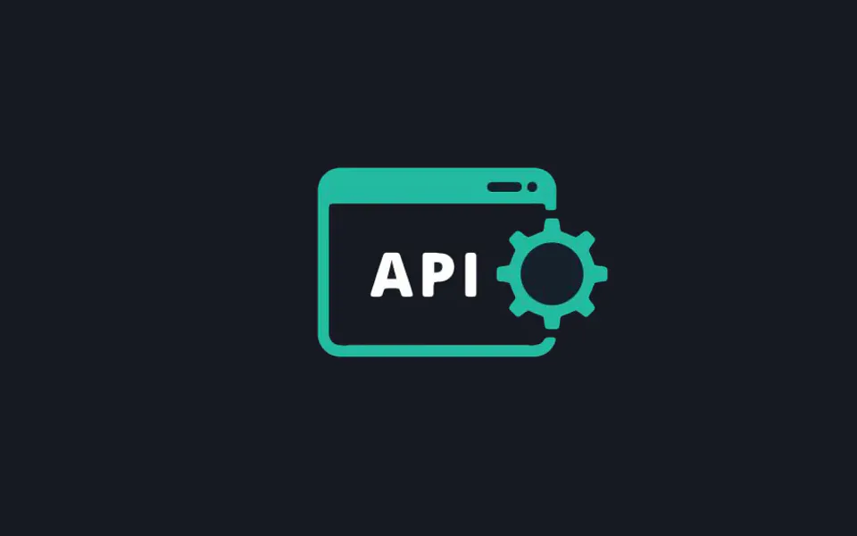

  

  <a href="https://emadrahimi.dev"><strong>Portfolio</strong></a>
  &nbsp;·&nbsp;
  <a href="mailto:contact@emadrahimi.dev"><strong>Email</strong></a>
  &nbsp;·&nbsp;
  <a href="https://linkedin.com/in/erahimidev"><strong>LinkedIn</strong></a>

## Selected work

<table>
  <tr>
    <td width="50%" valign="top">
      
      <h3><a href="https://satryar.ir">SatrYar</a></h3>
      
Persian-first document studio. Paste text, get a polished Word or PDF. Everything stays in the browser.

      
<code>Svelte 5</code> <code>TypeScript</code> <code>SvelteKit</code>

      
<a href="https://satryar.ir"><strong>Open product ↗</strong></a>

    </td>
    <td width="50%" valign="top">
      
      <h3><a href="https://github.com/ersync/cinemad">Cinemad</a></h3>
      
Film discovery across a deep catalogue, with a Rails API and a Vue interface built for browsing.

      
<code>Rails</code> <code>Vue</code> <code>PostgreSQL</code>

      
<a href="https://cinemad.emadrahimi.dev"><strong>Live ↗</strong></a> &nbsp; <a href="https://github.com/ersync/cinemad"><strong>Source ↗</strong></a>

    </td>
  </tr>
  <tr>
    <td width="50%" valign="top">
      
      <h3><a href="https://github.com/ersync/skeleton-loader">Skeleton Loader</a></h3>
      
Generate skeleton screens in Rails without shipping a client-side dependency.

      
<code>Ruby</code> <code>Rails</code> <code>CSS</code>

      
<a href="https://rubygems.org/gems/skeleton-loader"><strong>RubyGems ↗</strong></a> &nbsp; <a href="https://github.com/ersync/skeleton-loader"><strong>Source ↗</strong></a>

    </td>
    <td width="50%" valign="top">
      
      <h3><a href="https://github.com/ersync/persogen">Persogen</a></h3>
      
Realistic test identities from a documented and tested Rails API.

      
<code>Rails</code> <code>RSpec</code> <code>JWT</code> <code>REST</code>

      
<a href="https://github.com/ersync/persogen"><strong>Source ↗</strong></a>

    </td>
  </tr>
</table>

## Toolkit

<table>
  <tr>
    <td width="33%" valign="top">
      <strong>Backend</strong> 
      Ruby on Rails · PostgreSQL · REST APIs
    </td>
    <td width="33%" valign="top">
      <strong>Frontend</strong> 
      Vue · TypeScript · Svelte
    </td>
    <td width="33%" valign="top">
      <strong>Workflow</strong> 
      RSpec · Vite · GitHub Actions
    </td>
  </tr>
</table>
